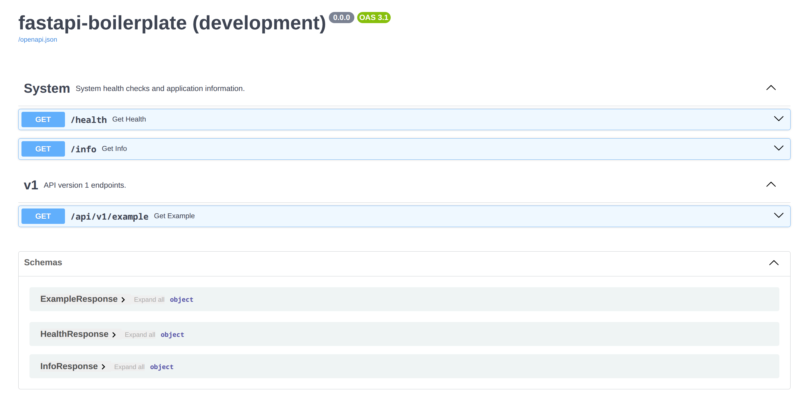

# FastAPI Boilerplate

[](https://github.com/meralialy/fastapi-boilerplate/actions)
[](https://docs.pytest.org/en/stable/how-to/plugins/python-coverage.html)

[](https://www.python.org/)
[](https://fastapi.tiangolo.com)
[](https://www.docker.com/)

[](https://opensource.org/licenses/MIT)
[](https://github.com/meralialy/fastapi-boilerplate/commits/main)

**A lean FastAPI boilerplate with batteries included.** Docker containerization, comprehensive testing setup, automated code quality checks, and a clean project structure—get up and running in seconds.

## Table of Contents

- [Tech Stack](#tech-stack)
- [Prerequisites](#prerequisites)
- [Getting Started](#getting-started)
- [Project Structure](#project-structure)
- [API Documentation](#api-documentation)
- [Code Quality](#code-quality)
- [Testing](#testing)
- [Makefile Commands](#makefile-commands)
- [CI/CD](#cicd)
- [Troubleshooting](#troubleshooting)

## Tech Stack

- **FastAPI** - High-performance async web framework
- **Python 3.14** - Core runtime environment
- **uv** - Fast dependency management
- **Uvicorn** - ASGI server
- **Docker** - Multi-stage containerization
- **Pytest** - Unit and integration testing
- **Ruff & MyPy** - Linting and type checking
- **GitHub Actions** - CI/CD automation

## Prerequisites

- **Python 3.14+** - Core runtime
- **uv** - Dependency management
- **Docker** - Containerization
- **Make** - Task automation

## Getting Started

### Clone

```bash
git clone https://github.com/meralialy/fastapi-boilerplate.git
cd fastapi-boilerplate
make setup
```

### Run with Docker

Launch the application in production-ready containers.

```bash
make docker-start                       # Start containers with development settings
make docker-start ENV=.env.production   # Start containers with production settings
make docker-logs                        # Follow container logs
make docker-stop                        # Stop containers and clean up
```

## Project Structure

```text
.
├── app/
│   ├── api/
│   │   ├── router.py           # Main API router
│   │   └── v1/                 # API v1 endpoints
│   ├── base/                   # System endpoints (health, info, root)
│   ├── configs/
│   │   ├── logger.py           # Logging configuration
│   │   └── settings.py         # Application settings
│   └── main.py                 # FastAPI application entry point
├── tests/                      # Test suite
├── .editorconfig               # EditorConfig configuration
├── .env.example                # environment variables
├── .gitattributes              # Git attributes configuration
├── .pre-commit-config.yaml     # Pre-commit hook configuration
├── docker-compose.yaml         # Docker Compose configuration
├── Dockerfile                  # Multi-stage Docker build
├── Makefile                    # Task automation
├── pyproject.toml              # Project metadata and dependencies
└── uv.lock                     # Locked dependency versions
```

## API Documentation

Interactive API documentation is automatically generated and available at:

- **Swagger UI**: http://localhost:8080/docs
- **ReDoc**: http://localhost:8080/redoc

<br>

## Code Quality

We enforce strict coding standards (PEP 8, 120-char limit, strict typing) using **[Ruff](https://github.com/astral-sh/ruff)** and **[MyPy](https://mypy-lang.org/)**.

```bash
make lint        # Check for linting errors
make lint-fix    # Automatically fix linting errors
make format      # Check code formatting (dry-run)
make format-fix  # Apply code formatting
```

## Testing

Ensure reliability with **[Pytest](https://docs.pytest.org/)** unit and integration tests.

```bash
make test                               # Run the full test suite
make test ARG="tests/test_main.py"      # Run tests in a specific file
make test ARG="-k 'test_health_check'"  # Run a specific test case by name
make code-coverage                      # Generate code coverage report
```

## Makefile Commands

This project uses a `Makefile` to automate common tasks.

| Command              | Description                   |
| :------------------- | :---------------------------- |
| `make install`       | Install dependencies          |
| `make install-hooks` | Install pre-commit git hooks  |
| `make clean`         | Remove .env and cache files   |
| `make test`          | Run all tests                 |
| `make code-coverage` | Generate code coverage report |
| `make lint`          | Check linting errors          |
| `make lint-fix`      | Auto-fix linting errors       |
| `make format`        | Check code formatting         |
| `make format-fix`    | Apply code formatting         |
| `make tidy`          | Run lint-fix and format-fix   |
| `make docker-start`  | Build and start containers    |
| `make docker-stop`   | Stop containers               |
| `make docker-clean`  | Remove images and volumes     |
| `make docker-logs`   | View container logs           |

## CI/CD

Automated workflows via **GitHub Actions** ensure code quality and reliability on every push.

- **Linting & Formatting** - Ruff checks code style and applies formatting standards
- **Type Checking** - MyPy validates type safety across the codebase
- **Unit & Integration Tests** - Pytest runs comprehensive test suite
- **Code Coverage** - Generates coverage reports to track test completeness
- **Docker Build** - Verifies container builds successfully

## Troubleshooting

### Port Conflicts

**Issue:** Port `8080` is already in use.<br>
**Solution:** Update the `PORT` variable in your .env file.

### Missing Dependencies

**Issue:** Import errors or missing packages.<br>
**Solution:** Ensure dependencies are up to date:

```bash
make install
```

### Docker Permission Denied

**Issue:** Access to the Docker daemon is restricted.<br>
**Solution:** Ensure your user account is a member of the `docker` group, or execute commands with `sudo`.
